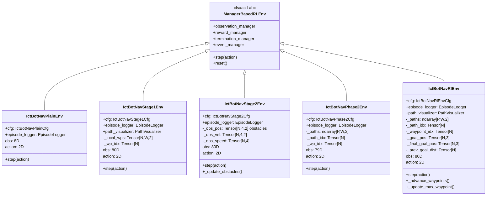
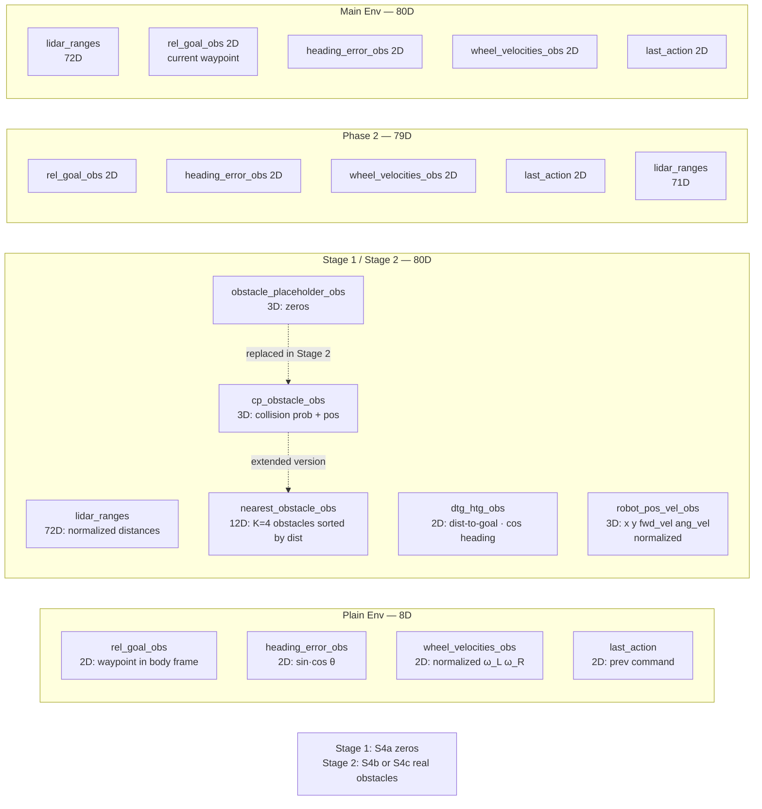
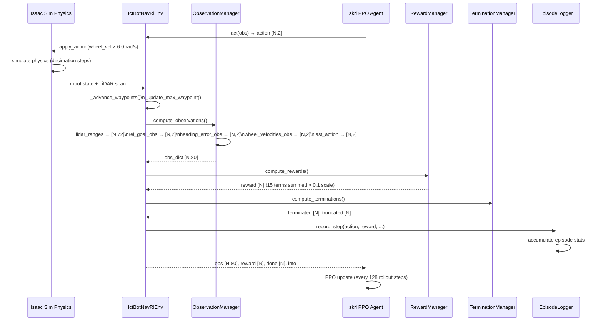

# Code Review Graph — ICTBot Navigation RL

## 1. Module Dependency Graph

```mermaid
graph TD
    %% ── Shared building blocks ──────────────────────────────────────────
    subgraph shared["Shared Modules"]
        ACT[actions.py\nJointVelocityActionCfg\n2-DOF wheel control]
        OBS[observations.py\n10+ observation functions\nLiDAR · goal · heading · obstacles]
        REW[rewards.py\n20+ reward functions\nnavigation · safety · efficiency]
        RCFG[robot_cfg.py\nICTBot asset + LiDAR\nsensor configuration]
        ELOG[episode_logger.py\nEpisodeLogger\nper-env stats · success rate]
        PVIZ[path_visualizer.py\nPathVisualizer\nreal-time Isaac Sim markers]
    end

    %% ── Plain (baseline) ────────────────────────────────────────────────
    subgraph plain["Plain Env (flat ground, no obstacles)"]
        PCFG[ict_bot_nav_plain_cfg.py\nIctBotNavPlainCfg\nobs=8D · no LiDAR]
        PENV[ict_bot_nav_plain_env.py\nIctBotNavPlainEnv]
    end

    %% ── Stage 1 ─────────────────────────────────────────────────────────
    subgraph stage1["Stage 1 (flat + full obs space for transfer)"]
        S1CFG[ict_bot_nav_stage1_cfg.py\nIctBotNavStage1Cfg\nobs=80D · sparse rewards]
        S1ENV[ict_bot_nav_stage1_env.py\nIctBotNavStage1Env\nlocal waypoints 0.6m]
    end

    %% ── Stage 2 ─────────────────────────────────────────────────────────
    subgraph stage2["Stage 2 (flat + 4 kinematic moving obstacles)"]
        S2CFG[ict_bot_nav_stage2_cfg.py\nIctBotNavStage2Cfg\nobs=80D · adds r_col]
        S2ENV[ict_bot_nav_stage2_env.py\nIctBotNavStage2Env\nkinematic obstacle dynamics]
    end

    %% ── Phase 2 ─────────────────────────────────────────────────────────
    subgraph phase2["Phase 2 (office + static walls + path-based reset)"]
        P2CFG[ict_bot_nav_phase2_cfg.py\nIctBotNavPhase2Cfg\nobs=79D · warm-start]
        P2ENV[ict_bot_nav_phase2_env.py\nIctBotNavPhase2Env]
    end

    %% ── Main env ────────────────────────────────────────────────────────
    subgraph main["Main Env (office + 100 A* paths + full rewards)"]
        MCFG[ict_bot_nav_rl_env_cfg.py\nIctBotNavRlEnvCfg\nobs=80D · 15 reward terms]
        MENV[ict_bot_nav_rl_env.py\nIctBotNavRlEnv\nwaypoint management · logging]
    end

    %% ── Entry points ────────────────────────────────────────────────────
    subgraph scripts["Scripts"]
        TRAIN[scripts/skrl/train.py\nPPO / TD3 training\nargparse entry point]
        PLAY[scripts/skrl/play.py\nevaluation + visualization\ncheckpoint loading]
        GPATHS[scripts/generate_paths.py\nA* pathfinding\ngenerates paths.npy]
        TXFR[scripts/transfer_weights_phase2.py\nweight transfer\nPhase1 → Phase2]
    end

    %% ── Registration ────────────────────────────────────────────────────
    INIT[__init__.py\ngym.register × 6 variants]

    %% ── Data / Assets ───────────────────────────────────────────────────
    subgraph data["Data & Assets"]
        PATHS[data/paths/paths.npy\nshape: P×W×2\n100 paths × waypoints]
        MAP[data/maps/office_map_partial.yaml\noccupancy grid metadata]
        USD[data/maps/office_env.usd\nIsaac Sim scene]
        URDF[urdf/ict_bot/ict_bot.usd\nrobot asset]
    end

    %% ── YAML agent configs ──────────────────────────────────────────────
    subgraph yamls["Agent Configs (agents/)"]
        Y0[skrl_ppo_cfg.yaml\nMain · PPO · 256-128-64 MLP]
        Y1[skrl_ppo_plain_cfg.yaml]
        Y2[skrl_ppo_stage1_cfg.yaml]
        Y3[skrl_ppo_stage2_cfg.yaml]
        Y4[skrl_ppo_phase2_cfg.yaml]
        Y5[skrl_td3_stage2_cfg.yaml]
    end

    %% ── Edges: shared → env configs ─────────────────────────────────────
    ACT  --> PCFG & S1CFG & S2CFG & P2CFG & MCFG
    OBS  --> PCFG & S1CFG & S2CFG & P2CFG & MCFG
    REW  --> PCFG & S1CFG & S2CFG & P2CFG & MCFG
    RCFG --> PCFG & S1CFG & S2CFG & P2CFG & MCFG

    %% ── Edges: configs → envs ───────────────────────────────────────────
    PCFG  --> PENV
    S1CFG --> S1ENV
    S2CFG --> S2ENV
    P2CFG --> P2ENV
    MCFG  --> MENV

    %% ── Edges: loggers / visualizers ────────────────────────────────────
    ELOG --> PENV & S1ENV & S2ENV & P2ENV & MENV
    PVIZ --> S1ENV & MENV

    %% ── Edges: data ─────────────────────────────────────────────────────
    PATHS  --> MENV & P2ENV
    URDF   --> RCFG
    USD    --> MCFG & P2CFG
    MAP    --> GPATHS
    GPATHS --> PATHS

    %% ── Edges: registration ─────────────────────────────────────────────
    PENV  --> INIT
    S1ENV --> INIT
    S2ENV --> INIT
    P2ENV --> INIT
    MENV  --> INIT

    %% ── Edges: yamls ────────────────────────────────────────────────────
    Y0 --> INIT
    Y1 --> INIT
    Y2 --> INIT
    Y3 --> INIT
    Y4 --> INIT
    Y5 --> INIT

    %% ── Edges: scripts ──────────────────────────────────────────────────
    INIT  --> TRAIN & PLAY
    TXFR  --> P2ENV

    %% Styles
    classDef shared  fill:#dbeafe,stroke:#3b82f6,color:#1e3a8a
    classDef env     fill:#dcfce7,stroke:#22c55e,color:#14532d
    classDef script  fill:#fef9c3,stroke:#eab308,color:#713f12
    classDef data    fill:#f3e8ff,stroke:#a855f7,color:#4a1d96
    classDef yaml    fill:#ffedd5,stroke:#f97316,color:#7c2d12
    classDef reg     fill:#fee2e2,stroke:#ef4444,color:#7f1d1d

    class ACT,OBS,REW,RCFG,ELOG,PVIZ shared
    class PCFG,PENV,S1CFG,S1ENV,S2CFG,S2ENV,P2CFG,P2ENV,MCFG,MENV env
    class TRAIN,PLAY,GPATHS,TXFR script
    class PATHS,MAP,USD,URDF data
    class Y0,Y1,Y2,Y3,Y4,Y5 yaml
    class INIT reg
```

---

## 2. Environment Class Hierarchy

---

## 3. Observation Space Breakdown

---

## 4. Reward Function Map

```mermaid
graph TD
    subgraph nav["Navigation Rewards (dense)"]
        R1["velocity_toward_target\nweight +3.0\nspeed · cos θ to WP"]
        R2["progress_delta\nweight +5.0\nΔdist to WP per step"]
        R3["reward_forward_speed\nweight +3.0\nspeed² toward WP"]
        R4["reward_heading_alignment\nweight +4.0\nclamp(cos θ, 0, 1)"]
        R5["waypoint_reached\nweight +20.0\nbinary on WP threshold"]
        R6["goal_reached\nweight +100.0\nbinary on final goal"]
        R7["goal_proximity\nweight varies\nexp(-dist/1.5)"]
    end

    subgraph safety["Safety Rewards (dense, negative)"]
        R8["obstacle_avoidance\nweight -6.0\n3-zone graduated 0.2–0.8m"]
        R9["wall_proximity\nweight -8.0\n1.0 - min_dist/threshold"]
        R10["spinning_penalty\nweight -5.0\n|ω| · exp(-3 v_fwd)"]
        R11["penalize_backwards_movement\nweight -3.0\n|v_rev|"]
        R12["fell_off\nweight -50.0\nrobot Z < -0.5m"]
        R13["action_rate_l2\nweight -0.1\nIsaac Lab built-in"]
        R14["is_alive\nweight -0.05\nper-step cost"]
    end

    subgraph clearance["Clearance Rewards (dense)"]
        R15["forward_clearance\nweight +2.0\nopen space ±30° forward"]
        R16["lateral_clearance_reward\nweight +12.0\nsteer to more open side"]
    end

    subgraph stage_specific["Stage-Specific (curriculum)"]
        R17["r_dtg\nStage 1/2: +1 if dist improved"]
        R18["r_htg\nStage 1/2: +1 if heading improved"]
        R19["r_local_wp\nStage 1/2: +1 on local WP"]
        R20["r_col\nStage 2: -1 on obstacle collision"]
    end

    REW[rewards.py] --> nav & safety & clearance & stage_specific

    PCFG[Plain Cfg] -->|uses| R1 & R3 & R6 & R10
    S1CFG[Stage 1 Cfg] -->|uses| R17 & R18 & R19 & R6 & R10
    S2CFG[Stage 2 Cfg] -->|uses| R17 & R18 & R19 & R6 & R8 & R20
    P2CFG[Phase 2 Cfg] -->|uses| R1 & R2 & R6 & R8 & R9 & R15 & R16
    MCFG[Main Cfg] -->|uses all 15| R1 & R2 & R3 & R4 & R5 & R6 & R8 & R9 & R10 & R11 & R12 & R13 & R14 & R15 & R16
```

---

## 5. Curriculum Training Pipeline

```mermaid
flowchart LR
    subgraph p0["Phase 0: Plain Ground"]
        E0[IctBotNavPlainEnv\nobs=8D · action=2D]
        C0[skrl_ppo_plain_cfg.yaml\nPPO · 256-128-64]
        CK0[(checkpoint_plain.pt)]
        E0 --> C0 --> CK0
    end

    subgraph p1["Phase 1: Stage 1 — Bridge"]
        E1[IctBotNavStage1Env\nobs=80D · LiDAR + sparse]
        C1[skrl_ppo_stage1_cfg.yaml]
        CK1[(checkpoint_stage1.pt)]
        E1 --> C1 --> CK1
    end

    subgraph p2["Phase 2: Stage 2 — Moving Obstacles"]
        E2[IctBotNavStage2Env\nobs=80D · 4 kinematic obs]
        C2[skrl_ppo_stage2_cfg.yaml\nor skrl_td3_stage2_cfg.yaml]
        CK2[(checkpoint_stage2.pt)]
        E2 --> C2 --> CK2
    end

    subgraph p3["Phase 3: Office Navigation"]
        E3[IctBotNavPhase2Env\nobs=79D · static walls]
        C3[skrl_ppo_phase2_cfg.yaml]
        CK3[(checkpoint_phase2.pt)]
        E3 --> C3 --> CK3
    end

    subgraph main["Main: Full Navigation"]
        E4[IctBotNavRlEnv\nobs=80D · 100 A* paths]
        C4[skrl_ppo_cfg.yaml]
        CK4[(checkpoint_main.pt)]
        E4 --> C4 --> CK4
    end

    TXFR[transfer_weights_phase2.py\narchitecture bridging]

    CK0 -->|warm-start\nextend obs layer| E1
    CK1 -->|direct load\nsame arch| E2
    CK1 --> TXFR -->|adapted weights| E3
    CK3 -->|warm-start| E4

    PLAY[scripts/skrl/play.py\nevaluation + visualization]
    CK4 --> PLAY
```

---

## 6. Data Flow — Inference Step

---

## Summary Table

| Module | File | Lines | Role |
|--------|------|-------|------|
| Robot config | [robot_cfg.py](source/ict_bot_nav_rl/ict_bot_nav_rl/tasks/direct/ict_bot_nav_rl/robot_cfg.py) | 84 | ICTBot asset + LiDAR sensor |
| Actions | [actions.py](source/ict_bot_nav_rl/ict_bot_nav_rl/tasks/direct/ict_bot_nav_rl/actions.py) | 13 | 2-DOF wheel velocity control |
| Observations | [observations.py](source/ict_bot_nav_rl/ict_bot_nav_rl/tasks/direct/ict_bot_nav_rl/observations.py) | 205 | 10+ obs functions (LiDAR, goal, heading, obstacles) |
| Rewards | [rewards.py](source/ict_bot_nav_rl/ict_bot_nav_rl/tasks/direct/ict_bot_nav_rl/rewards.py) | 466 | 20+ reward terms (navigation + safety + efficiency) |
| Episode logger | [episode_logger.py](source/ict_bot_nav_rl/ict_bot_nav_rl/tasks/direct/ict_bot_nav_rl/episode_logger.py) | 279 | Per-env stats, success rate, formatted log |
| Path visualizer | [path_visualizer.py](source/ict_bot_nav_rl/ict_bot_nav_rl/tasks/direct/ict_bot_nav_rl/path_visualizer.py) | 56 | Real-time Isaac Sim path markers |
| Plain env | [ict_bot_nav_plain_env.py](source/ict_bot_nav_rl/ict_bot_nav_rl/tasks/direct/ict_bot_nav_rl/ict_bot_nav_plain_env.py) | 96 | Baseline: flat ground goal-reaching |
| Stage 1 env | [ict_bot_nav_stage1_env.py](source/ict_bot_nav_rl/ict_bot_nav_rl/tasks/direct/ict_bot_nav_rl/ict_bot_nav_stage1_env.py) | 124 | Transfer bridge: flat + full obs |
| Stage 2 env | [ict_bot_nav_stage2_env.py](source/ict_bot_nav_rl/ict_bot_nav_rl/tasks/direct/ict_bot_nav_rl/ict_bot_nav_stage2_env.py) | 228 | Moving obstacles dynamics |
| Phase 2 env | [ict_bot_nav_phase2_env.py](source/ict_bot_nav_rl/ict_bot_nav_rl/tasks/direct/ict_bot_nav_rl/ict_bot_nav_phase2_env.py) | — | Office env warm-started from Phase 1 |
| Main env | [ict_bot_nav_rl_env.py](source/ict_bot_nav_rl/ict_bot_nav_rl/tasks/direct/ict_bot_nav_rl/ict_bot_nav_rl_env.py) | 104 | Full navigation: 100 A* paths |
| Training | [scripts/skrl/train.py](scripts/skrl/train.py) | — | PPO/TD3 entry point |
| Evaluation | [scripts/skrl/play.py](scripts/skrl/play.py) | — | Checkpoint rollout + visualization |
| Path gen | [scripts/generate_paths.py](scripts/generate_paths.py) | — | A* over office occupancy grid |
| Weight xfer | [scripts/transfer_weights_phase2.py](scripts/transfer_weights_phase2.py) | — | Architecture-bridging checkpoint adapter |
